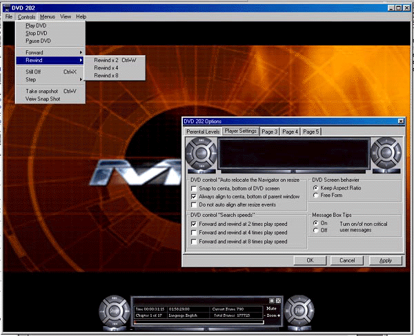



## DVD Player2002

### Description

DVD player, more features than any other I have seen on the planet to date and looks much better, this is a very good example of playing DVD's with VB, it started as an app to be published as shareware, but I got bored. So it is now open source. It is in no way finished but is fully functional.
 
### More Info
 

             |
---                |---
**Submitted On**   |2002-04-27 00:20:02
**By**             |[Jamie Pocock](https://github.com/Planet-Source-Code/PSCIndex/blob/master/ByAuthor/jamie-pocock.md)
**Level**          |Intermediate
**User Rating**    |5.0 (55 globes from 11 users)
**Compatibility**  |VB 6\.0
**Category**       |[Complete Applications](https://github.com/Planet-Source-Code/PSCIndex/blob/master/ByCategory/complete-applications__1-27.md)
**World**          |[Visual Basic](https://github.com/Planet-Source-Code/PSCIndex/blob/master/ByWorld/visual-basic.md)
**Archive File**   |[DVD\_Player764614272002\.zip](https://github.com/Planet-Source-Code/jamie-pocock-dvd-player2002__1-34167/archive/master.zip)

